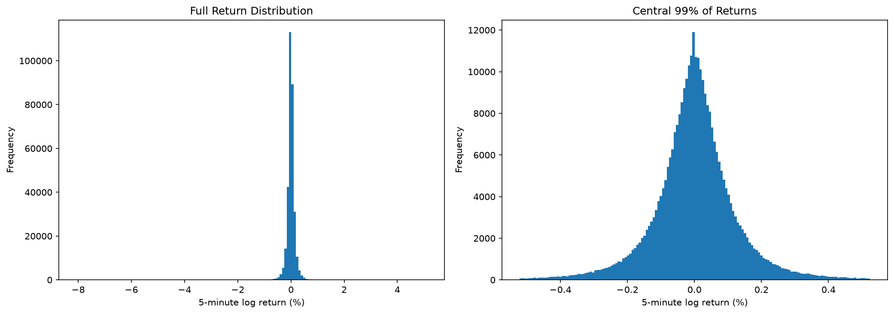
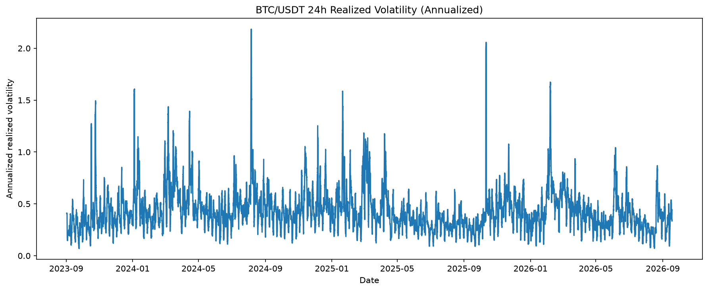

# Cryptocurrency Trading Research Framework

A quantitative cryptocurrency research project built around Freqtrade, Python, and Docker, covering historical market data analysis, strategy evaluation, and deployment-oriented trading infrastructure.

This repository is the public, reproducible research component of a broader private algorithmic trading project.

The private project has been used for backtesting, parameter experimentation, cross-asset evaluation, in-sample/out-of-sample testing, dry-run trading, and live deployment.

Proprietary alpha signals, trading credentials, and account-level records are intentionally excluded.

---

## 1. Project Overview

The project explores the end-to-end workflow of systematic cryptocurrency trading:

```text
Market Data Collection
        |
        v
Data Quality Validation
        |
        v
Market Analysis
        |
        v
Strategy Research
        |
        v
Backtesting & Evaluation
        |
        v
Out-of-Sample Validation
        |
        v
Dry-Run Trading
        |
        v
Live Deployment
```

The public repository focuses on reproducible market research, a simplified strategy interface, and a separate Docker research environment.

The full private trading system and its proprietary strategy are not included.

---

## 2. Technology Stack

| Component | Technology |
|---|---|
| Programming | Python |
| Data Analysis | Pandas, NumPy |
| Visualization | Matplotlib |
| Trading Framework | Freqtrade |
| Market Data | Binance Futures |
| Data Storage | Apache Feather |
| Deployment | Docker, Linux |
| Version Control | Git |

---

## 3. Repository Structure

```text
.
├── README.md
├── Dockerfile.research
├── docker-compose.yml
├── .gitignore
│
├── scripts/
│   └── download_data.sh
│
├── user_data/
│   ├── notebooks/
│   │   └── backtest_research.ipynb
│   │
│   └── strategies/
│       └── example_strategy.py
│
└── results/
    ├── return_distribution.png
    └── realized_volatility.png
```

Market data, trading databases, private configuration files, and live trading logs are excluded from version control.

---

## 4. Market Data Pipeline

The public research uses BTC/USDT perpetual futures data downloaded from Binance through Freqtrade.

### Dataset

| Property | Value |
|---|---|
| Exchange | Binance |
| Instrument | BTC/USDT Perpetual Futures |
| Frequency | 5 minutes |
| Format | Feather |
| Start Date | 2023-09-01 |
| End Date | 2026-09-17 |
| Observations | 320,540 |

The dataset was downloaded on September 18, 2026.

Historical data is not committed to this repository. Users can download it using the provided script.

### Data Quality Validation

The research notebook performs the following checks:

- Missing values
- Duplicate timestamps
- Missing five-minute candles
- OHLC price consistency
- Negative trading volume

Results from the downloaded dataset:

| Validation | Result |
|---|---:|
| Missing values | 0 |
| Duplicate timestamps | 0 |
| Missing candles | 0 |
| Invalid OHLC rows | 0 |
| Negative volume rows | 0 |

All implemented structural data quality checks passed.

These checks do not guarantee that every market observation is accurate. Extreme price movements require additional investigation.

---

## 5. Market Return Analysis

The research notebook calculates five-minute logarithmic returns:

```text
r_t = ln(P_t / P_(t-1))
```

where P_t represents the closing price at time t.

The analysis includes:

- Return distribution
- Descriptive return statistics
- Extreme market movements
- Rolling realized volatility

### Return Distribution



The visualization presents:

1. The full distribution of five-minute returns.
2. A zoomed view of the central 99% of observations.

Extreme observations are retained in the underlying dataset.

The zoomed view is used only to improve visualization.

---

## 6. Realized Volatility Analysis

A 24-hour rolling window is used to estimate realized volatility from five-minute log returns.

Annualization assumes continuous cryptocurrency trading:

```text
Annualized Volatility = Rolling Std × sqrt(365 × 24 × 12)
```

The analysis uses 288 five-minute observations per rolling window.

### Realized Volatility Through Time



Selected statistics:

| Metric | Value |
|---|---:|
| Mean Annualized Rolling Volatility | 43.42% |
| Median Annualized Rolling Volatility | 39.68% |
| Maximum Annualized Rolling Volatility | 218.38% |

These are descriptive statistics of the underlying BTC market, not returns or risk metrics of a trading strategy.

---

## 7. Extreme Market Movement Analysis

The notebook identifies the five largest absolute five-minute returns.

The purpose is to examine market tail behavior and identify observations that may require further validation.

For example, the dataset contains a five-minute log return of approximately -8.07% on October 10, 2025, at 21:15 UTC.

Extreme observations are not automatically deleted or winsorized.

The current checks establish structural consistency but do not independently verify every extreme observation against an external market data source.

---

## 8. Strategy Research Methodology

The broader private research project has included:

- Strategy backtesting
- Parameter combination experiments
- Cross-asset performance comparisons
- In-sample and out-of-sample testing
- Backtest and dry-run performance comparisons
- Live trading deployment

These activities are part of the broader research workflow.

Detailed proprietary strategy implementations, experiment artifacts, and private performance results are not published in this repository.

The public notebook currently implements market data validation, return analysis, volatility analysis, and extreme-movement analysis.

Additional public evaluation demonstrations may be added using explicitly identified illustrative strategies and non-confidential data.

---

## 9. Public Strategy Interface

The repository includes:

```text
user_data/strategies/example_strategy.py
```

This file illustrates integration with the Freqtrade strategy interface.

It is a simplified public example, not the proprietary production strategy.

Its signals and parameters should not be interpreted as a validated trading strategy or used for live trading without independent testing and risk review.

---

## 10. Reproducibility

### Requirements

- Docker
- Git
- Internet access for downloading public market data

Python dependencies are provided through a separate research Docker image.

The research environment is isolated from the private live trading deployment.

### Step 1: Clone the Repository

```bash
git clone https://github.com/YOUR_USERNAME/YOUR_REPOSITORY.git

cd YOUR_REPOSITORY
```

Replace the placeholder repository URL with the actual GitHub URL.

### Step 2: Build the Research Environment

```bash
docker build \
  -f Dockerfile.research \
  -t crypto-research:latest \
  .
```

### Step 3: Download Market Data

```bash
bash scripts/download_data.sh
```

The script downloads public BTC/USDT five-minute futures OHLCV data.

Downloaded market data is stored locally under:

```text
user_data/data/
```

This directory is excluded from Git.

Historical data returned by the exchange may change over time. Reproducing the exact original observations is not guaranteed.

### Step 4: Run the Research Analysis

From the repository root:

```bash
docker run --rm \
  --entrypoint python \
  -v "$PWD:/workspace:ro" \
  -w /workspace \
  -e MPLBACKEND=Agg \
  crypto-research:latest \
  -c "import json; import matplotlib.pyplot as plt; plt.show=lambda: plt.close('all'); nb=json.load(open('user_data/notebooks/backtest_research.ipynb')); code='\n\n'.join(''.join(c['source']) for c in nb['cells'] if c['cell_type']=='code'); exec(compile(code, 'backtest_research.ipynb', 'exec'))"
```

This command executes the notebook's code cells and prints the analytical results. Interactive plots are suppressed in this command-line execution mode.

The repository includes previously generated figures in the `results/` directory.

---

## 11. Research and Production Separation

The project separates public research materials from private trading infrastructure.

```text
Private Trading Project
        |
        |-- Proprietary Strategy
        |-- Private Configuration
        |-- Trading Credentials
        |-- Trading Databases
        |-- Live Execution
        |
        v
Public Research Repository
        |
        |-- Market Data Analysis
        |-- Data Quality Checks
        |-- Research Notebook
        |-- Public Strategy Example
        |-- Reproducible Docker Environment
        |-- Visualizations
```

The public Docker configuration does not start a live trading bot.

No exchange credentials are required to run the public market research workflow.

---

## 12. Security and Confidentiality

The following materials are intentionally excluded:

- Exchange API keys and secrets
- Private configuration files
- Proprietary alpha models and signal logic
- Production strategy parameters
- Live and dry-run trading databases
- Account balances and execution records
- Private trading logs
- Private backtest and optimization artifacts

The public repository is intended to demonstrate research methodology and engineering practices without exposing confidential trading information.

---

## Disclaimer

This project is intended for quantitative research and educational demonstration.

The published market statistics do not represent trading strategy performance.

Historical analysis does not guarantee future results.

Nothing in this repository constitutes investment advice or a recommendation to trade.
